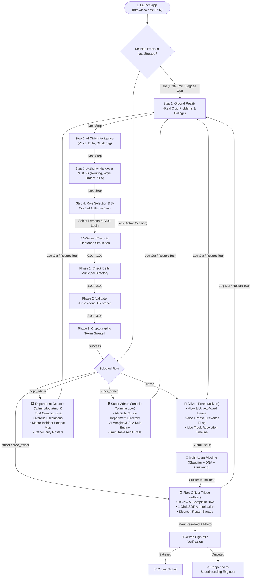

# JanSahayak (जनसहायक) — End-to-End System & User Flow

This document details the **complete operational and user flow** of JanSahayak, from first launch through the 4-step onboarding journey, simulated 3-second authentication, and role-segregated municipal execution.

---

## 🗺️ High-Level User Flow Architecture



---

## 📱 Phase 1: The 4-Step Interactive Onboarding Flow

When visiting `http://localhost:3737/` without an existing session, the website starts directly in the **Guided System Tour** ([`OnboardingFlow.jsx`](file:///c:/Users/rauts/OneDrive/Desktop/Jan_Sahayak/src/components/onboarding/OnboardingFlow.jsx)):

### **Step 1: Ground Reality (Asli Samasya Kya Hai?)**
- **Objective**: Explain municipal breakdowns in simple, everyday language everyone can understand.
- **Visual Asset**: The high-resolution Delhi civic problems collage (`citizen-bg.jpg`) showing:
  - 🕳️ **Damaged Roads & Cavities**: Road subsidences causing two-wheeler accidents.
  - 🚰 **Contaminated Water Supply**: Sewage line mixing into drinking water pipelines.
  - 🗑️ **Stray Garbage & Overflowing Dhalavs**: Toxic open dumping in residential areas.
  - 💡 **Dark Spots & Non-Functional Streetlights**: Safety hazards for women and seniors.
- **The Core Barrier**: Explains why legacy portals fail (complaints bounced across 10 departments, duplicate backlogs, no human accountability).

### **Step 2: AI Civic Intelligence (Hum Ise Kaise Address Karte Hain?)**
- **Objective**: Demonstrate how JanSahayak eliminates complex official forms.
- **3-Stage Visual Pipeline**:
  1. **Multimodal Voice/Text**: Citizens simply speak in colloquial Hindi, Hinglish, or English via voice note or photo.
  2. **Complaint DNA Extraction**: AI extracts category, severity, ward, and asset tags in seconds without human delay.
  3. **Spatial Incident Clustering**: 15 individual citizen calls from the same corridor are grouped into **1 Single High-Priority Incident**, completely eliminating duplicate backlogs.

### **Step 3: Actionable Authority Handover with Solutions**
- **Objective**: Show how problems are converted into immediate on-ground action.
- **Key Modules**:
  - **Exact Department Auto-Routing**: Direct delivery to Delhi Jal Board (DJB), PWD, MCD, or BSES.
  - **Pre-Computed Field SOPs**: Generates ready-to-execute work orders (e.g. *"Mobilize DJB Quick-Response Squad #4 with 100mm valve repair clamp & chlorine test kit"*).
  - **12-Hour SLA Timer & Closed-Loop Citizen Sign-Off**: Resolution requires an actual on-site photo; tickets cannot be closed without citizen verification.

### **Step 4: Role Selection & 3-Second Credential Authentication**
- **Objective**: Let evaluators, officers, or citizens select their role and witness a realistic security clearance check.
- **Role Options**:
  - 👤 **Citizen**: Aditya Verma (Ward 14, Rohini)
  - 🛠️ **Government Field Officer**: Er. Sanjay Sharma (AEE DJB)
  - 🏛️ **Department Admin**: Er. Rajiv Malhotra (Chief Engineer, DJB)
  - 🛡️ **Super Admin**: Dr. Meenakshi Sundaram, IAS (Principal Secretary)
- **⚡ 3-Second Verification Simulation**:
  - **0.0s – 1.0s**: Spinner + *"Checking credentials with Delhi Municipal Directory..."* (Progress 15% ➔ 50%)
  - **1.0s – 2.0s**: *"Validating jurisdictional authorization & security clearance for [Role]..."* (Progress 50% ➔ 85%)
  - **2.0s – 3.0s**: *"Cryptographic token granted. Access Granted! Loading workspace..."* (Progress 100%)
  - User is immediately routed to their designated workspace!

---

## 🏛️ Phase 2: Role-Segregated Workspace Execution

| Persona | Primary URL | Header Navigation | Top-Right Action CTA | Core Views & Responsibilities |
| :--- | :--- | :--- | :--- | :--- |
| 👤 **Citizen** | `/citizen` | My Grievances, File Grievance, How it Works | `+ File Grievance` | View personal tickets, submit voice/text grievance, live track repair squads, rate resolution. |
| 🛠️ **Field Officer** | `/officer` | Triage Workspace, Ward Heatmap, Civic Intelligence | `Triage Queue` | Review AI brief, approve/modify pre-computed SOPs, dispatch field squads, upload completion photos. |
| 🏛️ **Dept Admin** | `/admin/department` | Department Console, Officer Queue, Heatmap, Hotspots | `Dept Console` | Monitor ward SLA compliance, reassign overloaded officers, inspect recurring hotspot clusters. |
| 🛡️ **Super Admin** | `/admin/super` | Super Admin, Departments, Officers, Heatmap, Intelligence | `Admin Console` | All-Delhi municipal oversight, adjust AI scoring weights, configure SLA rules, inspect cryptographic audit trails. |
| 🌐 **Public / Guest** | `/overview` | Overview, 3-Step Tour, Impact | `Track Ticket`, `Login` | 20-second lifecycle demo, public impact counters, transparency statistics. |

---

## 🔄 Phase 3: Closed-Loop Complaint Lifecycle

1. **Intake**: Citizen files via voice, photo, or guided form (`/citizen/submit`).
2. **AI DNA Analysis**: Multi-agent system analyzes language, urgency score (0–100), and correlates with existing incident clusters.
3. **Field Dispatch**: Assigned Executive Engineer reviews AI recommendation and clicks **"Accept Standard SOP"**.
4. **On-Site Resolution**: Squad executes repair, uploads resolution photo, and enters completion notes.
5. **Citizen Sign-Off**: The citizen receives a push notification with before/after photos. They can:
   - Click **"Accept & Rate Resolution"** (1 to 5 stars) ➔ Case moves to `RESOLVED` / `CLOSED`.
   - Click **"Dispute & Reopen"** ➔ Case escalates automatically to Superintending Engineer with high priority.

---

## 🛡️ Error Recovery & Offline Resilience

1. **Clean Starting Session**: First-time visits start cleanly at Onboarding without hardcoded auto-logins.
2. **Offline-Resilient Demo Auth**: Demo login works 100% client-side instantly even if the backend Express API is not running.
3. **Proxy Error Suppression**: In [`vite.config.js`](file:///c:/Users/rauts/OneDrive/Desktop/Jan_Sahayak/vite.config.js), Vite's proxy error handler catches `ECONNREFUSED` so terminal windows are never spammed with connection refused stack traces.
4. **403 Self-Healing**: If a user bookmarks or lands on a restricted URL, the 403 Forbidden screen contains 1-click switcher buttons to immediately unlock the module.

---

## 🚀 Running the Platform

### Option 1: Single-Command Launch (Backend + Frontend)
```bash
npm start
```
*Starts the Express API server on `http://localhost:3001` and Vite frontend on `http://localhost:3737` simultaneously.*

### Option 2: Separate Terminals
```bash
# Terminal 1: Backend API Server
npm run server

# Terminal 2: Vite Frontend Dev Server
npm run dev
```

### Option 3: Production Build
```bash
npm run build
```
*Compiles all assets and optimizes bundle into `/dist` (tested and passing with Exit Code 0).*
